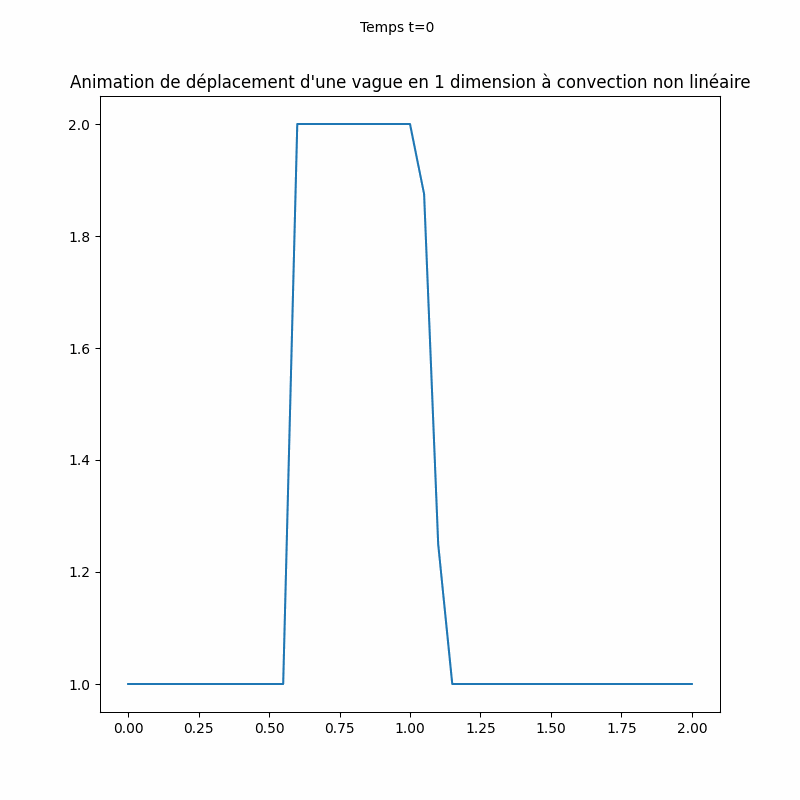
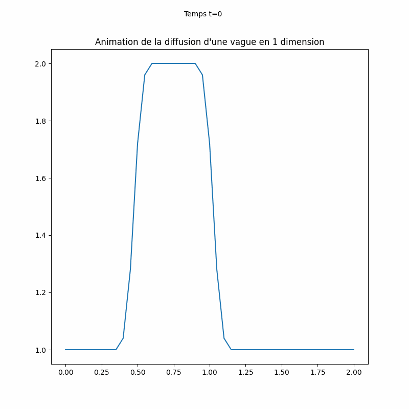

# Navier Stokes CFD
Simulateur de mécanique des fluides.  

Capacités actuelles :
* Convection linéaire en 1 dimension  
* Convection non-linéaire en 1 dimension  
* Diffusion en 1 dimension
* Equation du Burgers et signal en dents de scie

Les 3 programmes possèdent un mode animé, chronographie, et état final

Fondé sur le cours suivant : https://lorenabarba.com/blog/cfd-python-12-steps-to-navier-stokes/

## Exemples :

Step 5 - Convection linéaire en 2 dimensions

Step 1 - Convection linéaire en 1 dimension

Step 2- Convection non-linéaire en 1 dimension

Step 3 - Diffusion en 1 dimension

Step 4 - Signal en dents de scie
